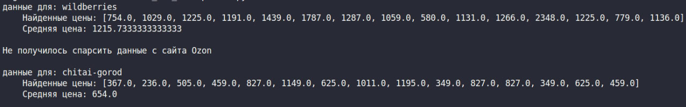
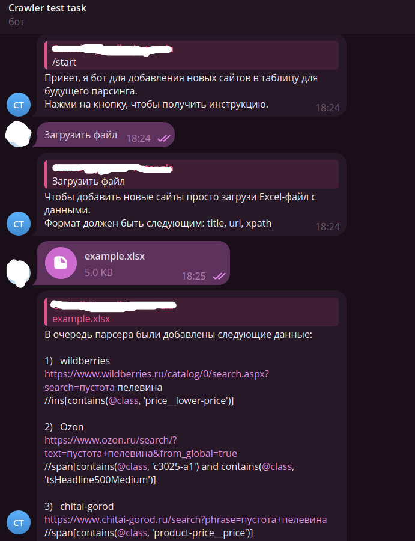

Через бота можно добавлять в таблицу сайты для их последующего парсинга.
Чтобы запустить парсинг сайтов нужно запустить файл parser.py, данные выводятся в консоль. (скрин ниже)
Парсер парсит одну страницу, на которую дана ссылка, все товары. (задание со звездочкой)

В проекте есть файл example.xlsx в сайтами и xpath. Парсится информация о книге "Чапаев и пустота",
на маркетпейсах вайлдберриз, озон и книжном магазине читай-город.

### ИНСТРУКЦИЯ ПО РАЗВЕРТЫВАНИЮ:
    1. Создать виртуальное окружение с помощью команды "python -m venv .venv"
    2. Активировать окружение с помощью "source .venv/bin/activate"
    3. Ввести в терминале команду "pip install -r requirements.txt"
    4. Задать в значение переменной API_TOKEN в файле main.py свой токен
    5. Запустить файл main.py
    6. После добавления в таблицу нужных сайтов через бота запустить parser.py

